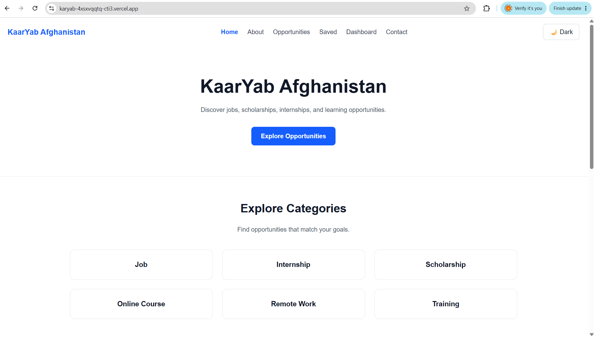
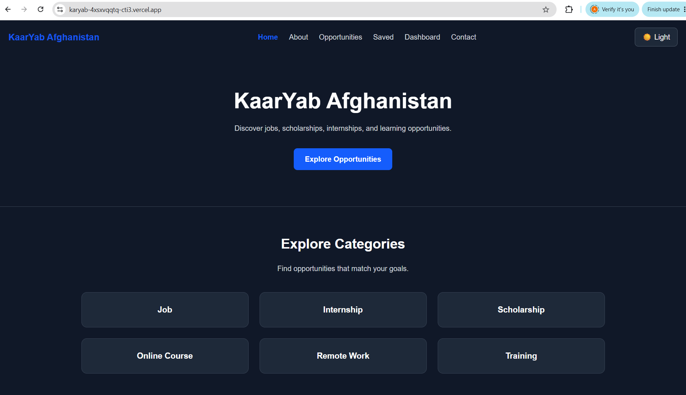
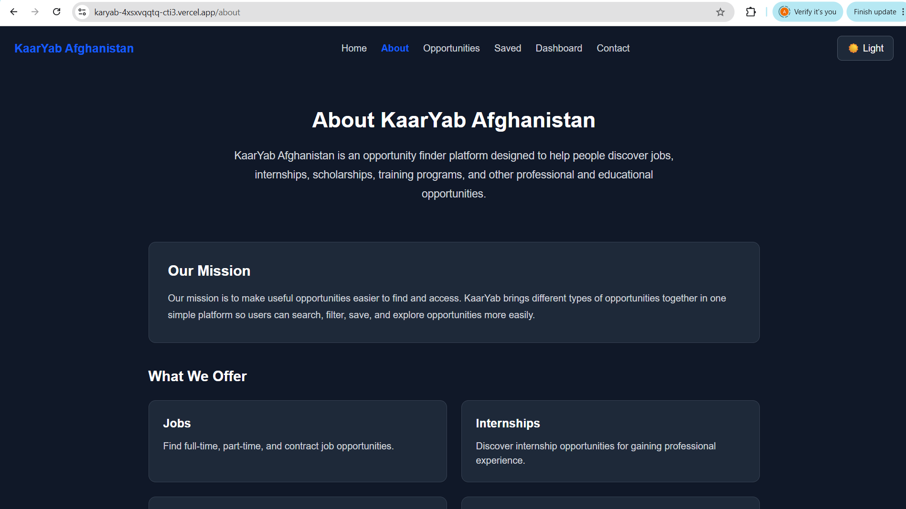
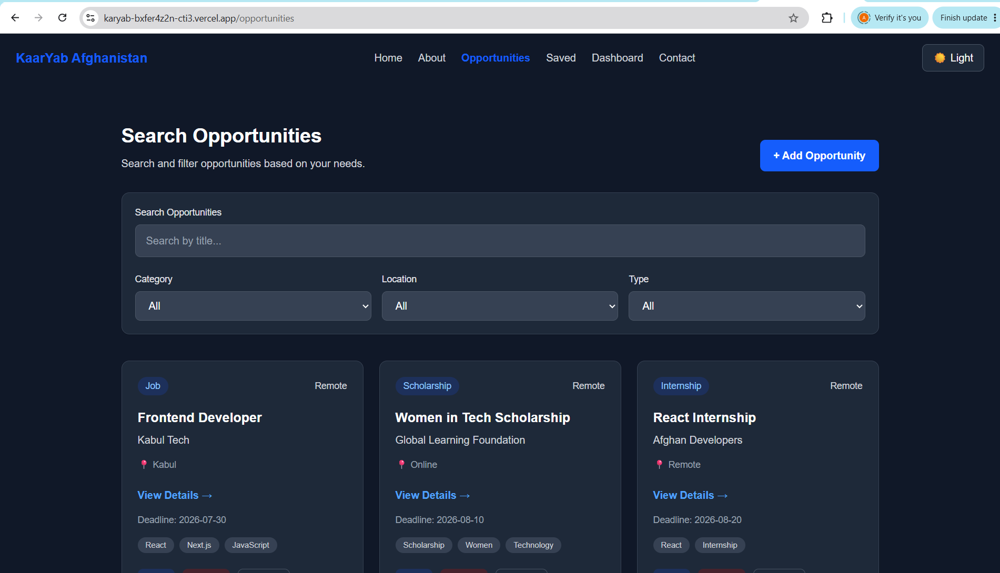
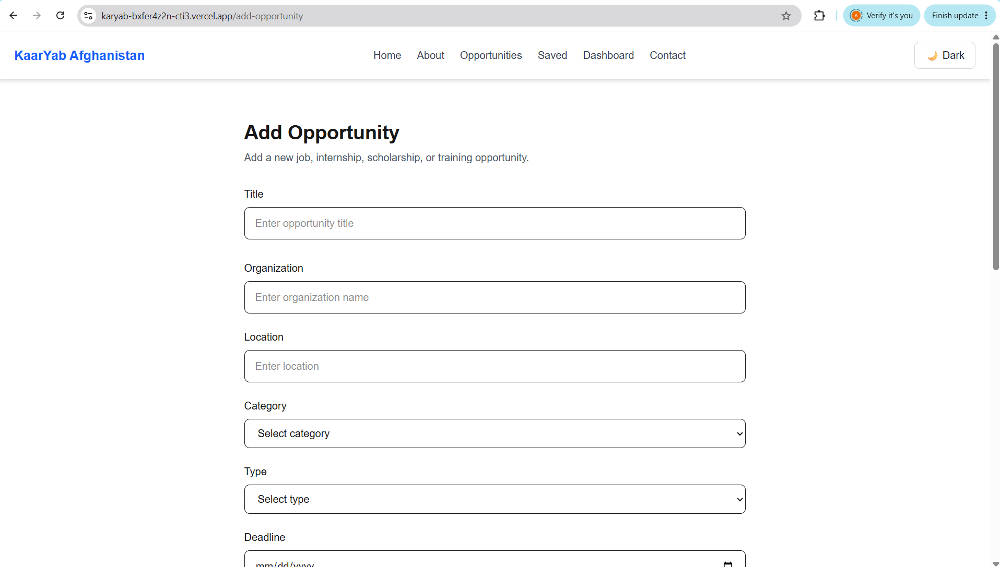
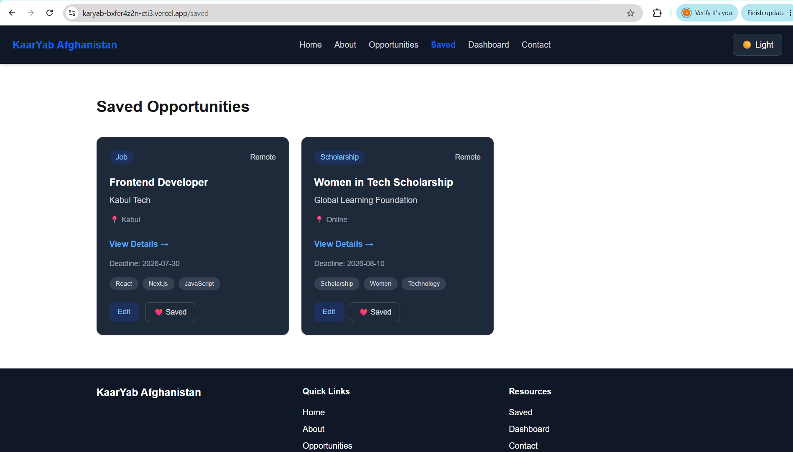
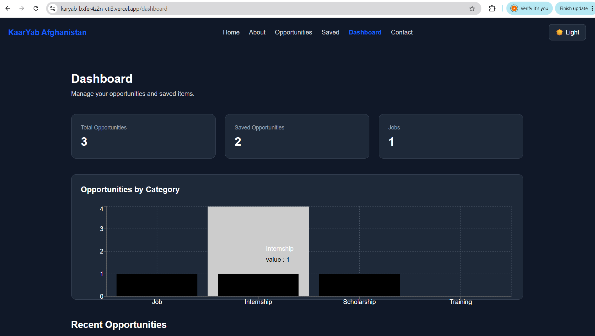
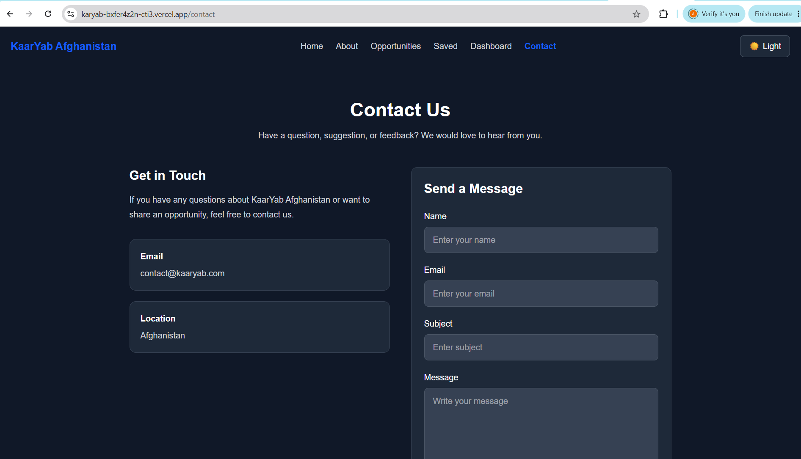
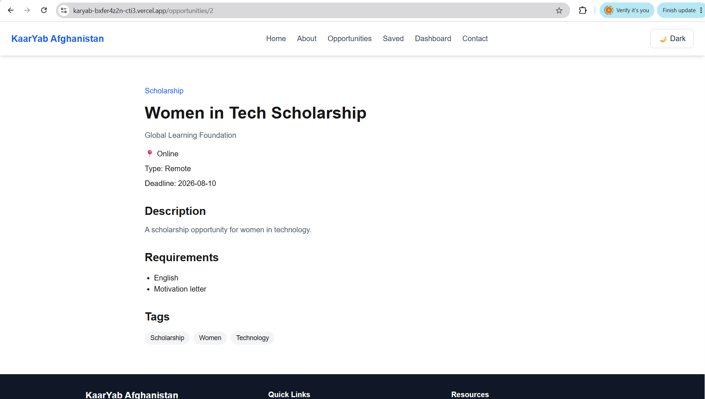

# KaarYab Afghanistan 🇦🇫

KaarYab Afghanistan is an opportunity finder platform designed to help users discover jobs, internships, scholarships, training programs, courses, and other professional and educational opportunities.

The platform provides a simple and accessible interface where users can search, filter, view, save, add, edit, and delete opportunities.

## 🚀 Live Demo

[View KaarYab Afghanistan](https://karyab-bxfer4z2n-cti3.vercel.app/)

> Replace the link above with your actual Vercel deployment URL.

## 📌 Features

- Browse available opportunities
- Search opportunities by title
- Filter opportunities by:

  - Category
  - Location
  - Type

- View detailed opportunity information
- Save opportunities for later
- Add new opportunities
- Edit existing opportunities
- Delete opportunities with confirmation
- Dashboard with opportunity statistics
- Opportunities by category chart
- Recently added opportunities
- Form validation using Zod
- Empty states for unavailable results
- Responsive design for different screen sizes
- Light and Dark Mode
- Accessible form controls and interactive elements

## 🛠️ Technologies

- Next.js
- React
- JavaScript
- Tailwind CSS
- Recharts
- Zod
- React Hooks
- LocalStorage
- Git & GitHub
- Vercel

## 📂 Project Structure

```text
karyab/
├── app/
│   ├── about/
│   ├── add-opportunity/
│   ├── contact/
│   ├── dashboard/
│   ├── opportunities/
│   ├── saved/
│   ├── globals.css
│   └── layout.jsx
│
├── components/
│   ├── CategoryChart.jsx
│   ├── ConfirmModal.jsx
│   ├── EmptyState.jsx
│   ├── OpportunitiesSearch.jsx
│   ├── OpportunityCard.jsx
│   ├── OpportunityForm.jsx
│   ├── ThemeToggle.jsx
│   └── ...
│
├── data/
│   └── opportunities.js
│
├── mock/
│   └── OpportunitiesApi.js
│
├── validation/
│   └── opportunitySchema.js
│
├── public/
│
├── package.json
└── README.md
```

## ⚙️ Getting Started

### 1. Clone the repository

```bash
git clone YOUR_GITHUB_REPOSITORY_URL
```

### 2. Navigate to the project directory

```bash
cd karyab
```

### 3. Install dependencies

```bash
npm install
```

### 4. Start the development server

```bash
npm run dev
```

Open your browser and visit:

```text
http://localhost:3000
```

## 🏗️ Production Build

To create a production build:

```bash
npm run build
```

To start the production server:

```bash
npm start
```

## 💾 Data Storage

This project currently uses **LocalStorage** for user-created and saved opportunities.

The application stores:

```text
opportunities
savedOpportunities
```

in the browser's LocalStorage.

This means the current version does not require a separate backend database.

## ♿ Accessibility

Accessibility was considered throughout the interface by using:

- Semantic HTML elements
- Proper form labels
- Accessible buttons and inputs
- Keyboard-friendly interactive elements
- Visible focus states
- Sufficient text contrast
- `aria-pressed` for the Save button
- Responsive layouts

## 🌙 Dark Mode

KaarYab supports both:

- Light Mode
- Dark Mode

Users can switch between themes using the Theme Toggle in the navigation bar.

The selected theme is stored in LocalStorage so it can persist across page refreshes.

## 📊 Dashboard

The Dashboard provides an overview of:

- Total opportunities
- Saved opportunities
- Job opportunities
- Opportunities grouped by category
- Recently added opportunities

## 🔮 Future Improvements

Possible future improvements include:

- Backend API integration
- Database integration
- User authentication
- Individual user accounts
- Real-time opportunity updates
- Email notifications
- Advanced search
- Pagination
- Admin dashboard
- AI-powered opportunity recommendations

## Screenshots



















## 👩‍💻 Author

Developed as a web development project focused on creating a simple, accessible, and useful opportunity discovery platform for Afghanistan.

## 📄 License

This project is developed for educational and portfolio purposes.

```

```
